# QuickDraw-Generator-Classifier

使用 CDCGAN 生成图片，使用 ResNet34 对图片进行分类。数据集来自 [Quick, Draw](https://github.com/googlecreativelab/quickdraw-dataset)

## 效果

|               airplane               |              bicycle               |               butterfly                |             cake             |              camera              |
| :----------------------------------: | :--------------------------------: | :------------------------------------: | :--------------------------: | :------------------------------: |
| 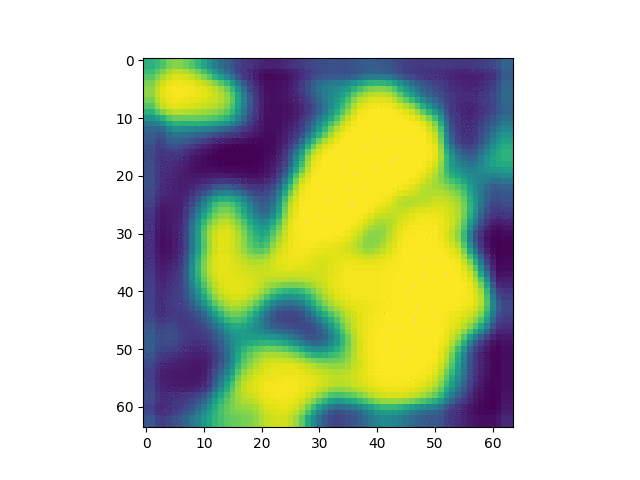 | 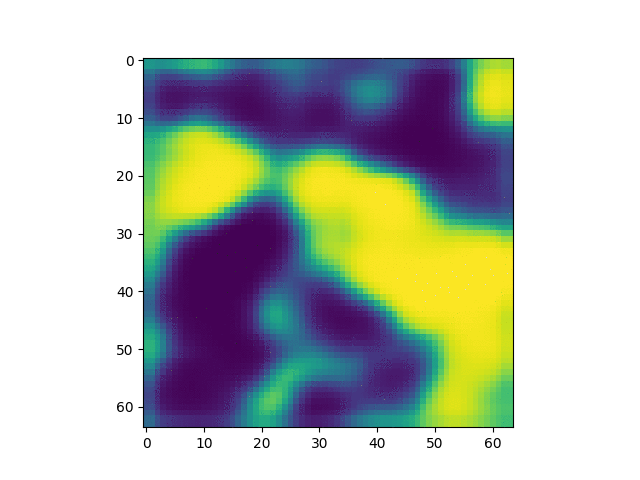 | 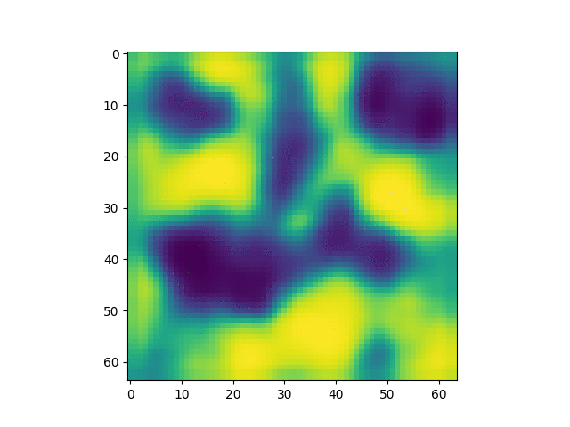 | 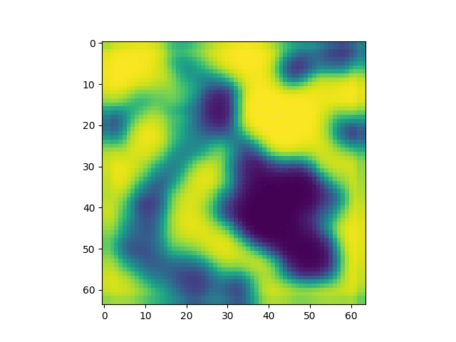 | 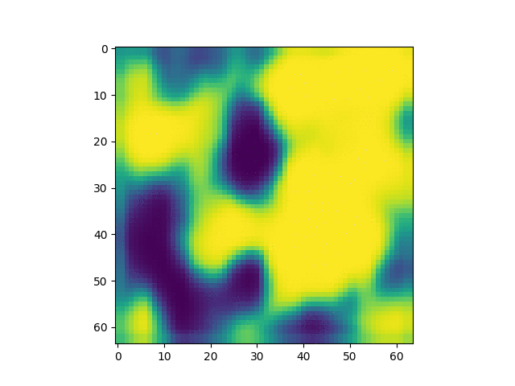 |

|             chair              |             clock              |              diamond               |                 The Effiel Tower                 |             tree             |
| :----------------------------: | :----------------------------: | :--------------------------------: | :----------------------------------------------: | :--------------------------: |
| 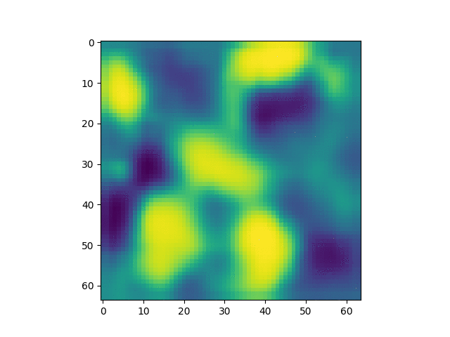 | 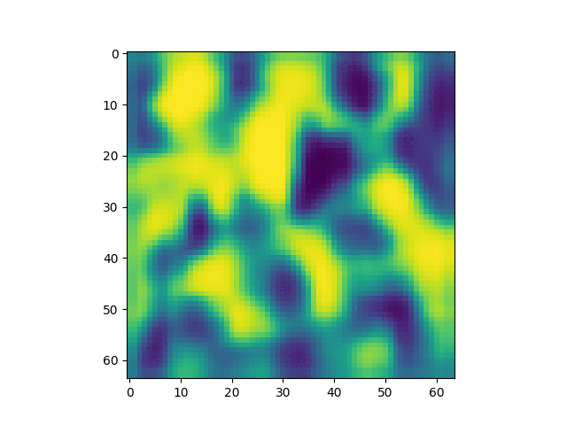 | 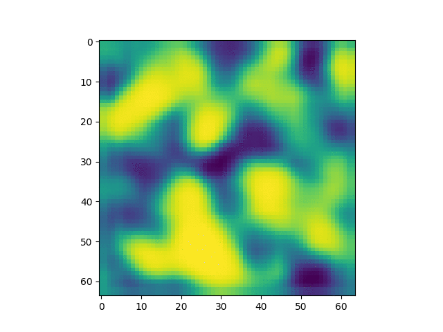 | 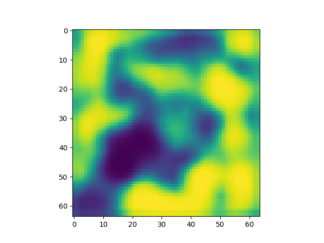 | 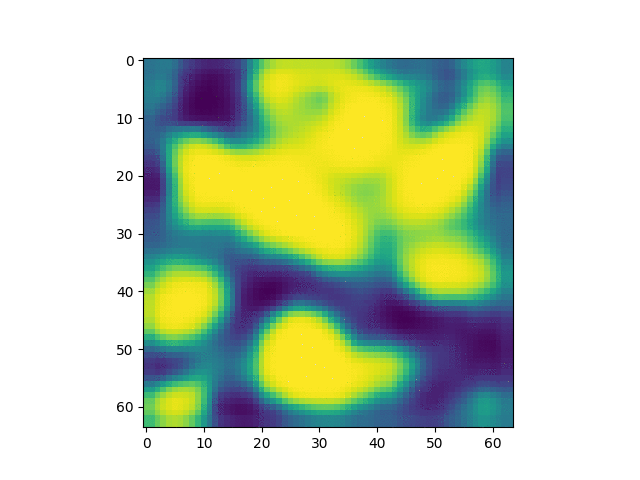 |

## 生成器

Model: CDCGAN

|          |                    Discriminator Loss                    |                    Generator Loss                    |                 Result                  |
| :------: | :------------------------------------------------------: | :--------------------------------------------------: | :-------------------------------------: |
| airplane | 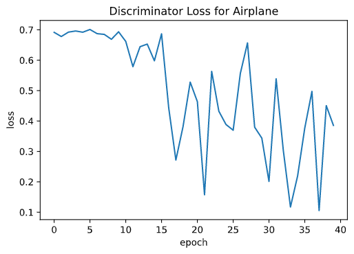 | 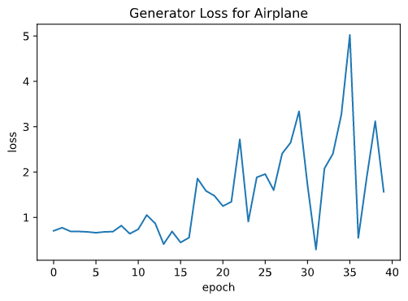 | 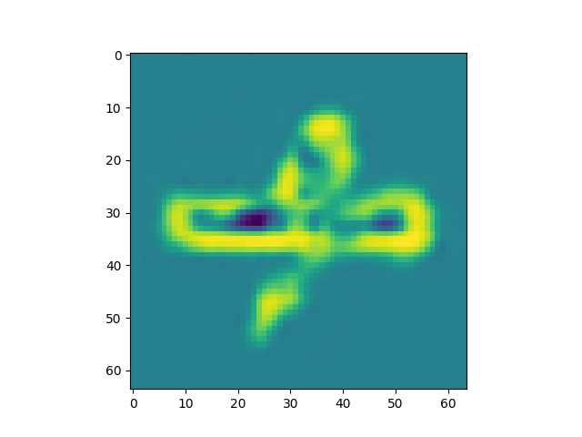 |
|  camera  |  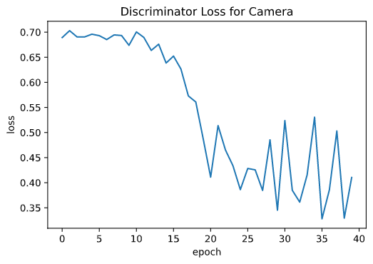  |  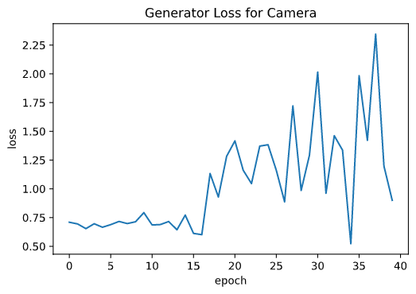  |   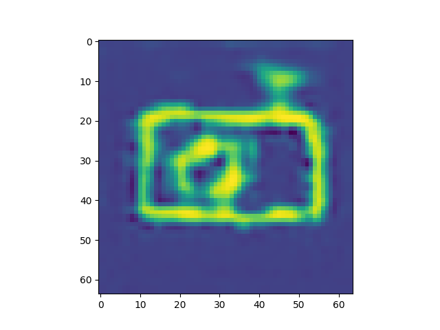   |

## 分类器

Model: ResNet34  

|          |                        Train                        |                       Test                        |
| :------: | :-------------------------------------------------: | :-----------------------------------------------: |
|   Loss   |   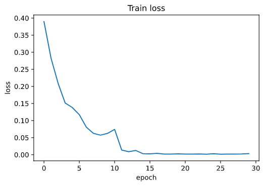   |   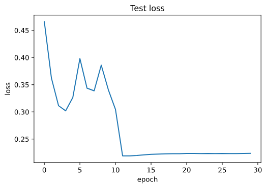   |
| Accuracy | 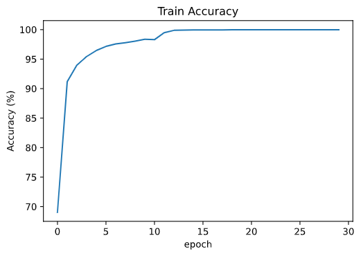 99% | 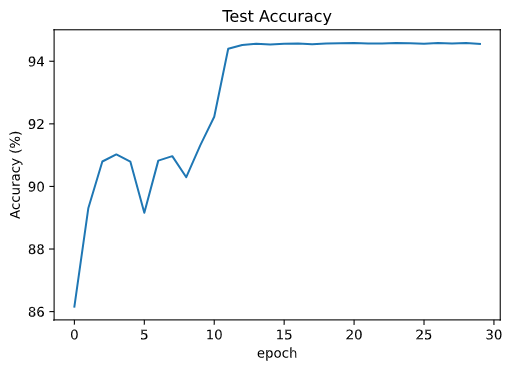 96% |

## 使用方法

+ 下载数据和生成数据集

  ```bash
  cd DataUtils
  python dataset_loader.py
  ```

+ 开始训练

  1. CDCGAN

     ```bash
     cd Generation
     python cdcgan.py
     ```

  2. ResNet34

     ```bash
     cd Classification
     python resnet34.py
     ```

+ 图片分类

  ```
  python quickdraw.py
  ```

